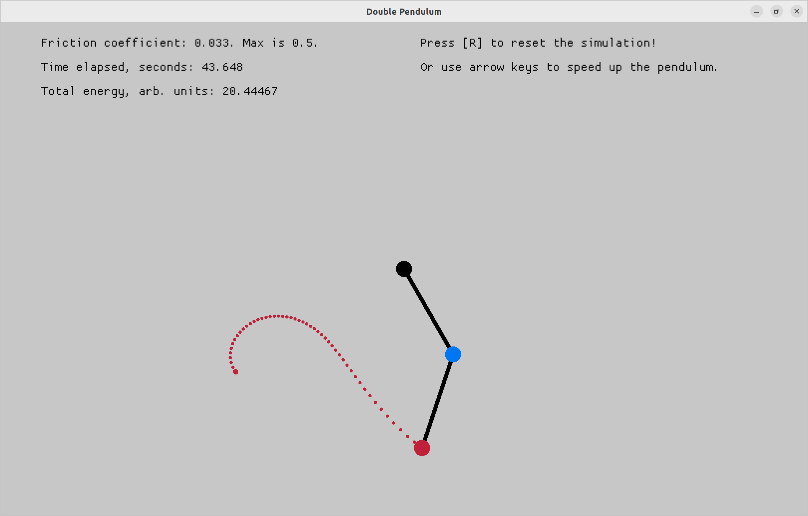

# Double pendulum simulation

The masses and the lengths are the same. The only free parameter in the simulation is the frequency:

$$ \omega = \sqrt{\frac{g}{l}} = \frac{2 \pi}{T} $$

Let's call the angles $\theta, \phi$, their difference $\delta = \theta - \phi$ and the canonical momenta $p, q$. Then the Lagrangian equations are:

$$\dot{\theta} = \frac{p - q \cos \delta}{1 + \sin^2 \delta}$$

$$\dot{\phi} = \frac{2q - p \cos \delta}{1 + \sin^2 \delta}$$

$$\dot{p} = - \dot{\theta} \dot{\phi} \sin \delta - 2 \omega^2 \sin \theta$$

$$\dot{q} = \dot{\theta} \dot{\phi} \sin \delta - \omega^2 \sin \phi$$

And the total energy (scaled by $m l^2$) is:

$$H = \frac{1}{2} p \dot{\theta} + \frac{1}{2} q \dot{\phi} - \omega^2 (2 \cos \theta + \cos \phi)$$

The simulation is made using 4th order Runge-Kutta scheme, and the animation is created using the macroquad crate.

---

## Update 2022-12-19

Added dissipative force, which user can control. The force changes the momentum equations:

$$\dot{p} = - \dot{\theta} \dot{\phi} \sin \delta - 2 \omega^2 \sin \theta - c p$$

$$\dot{q} = \dot{\theta} \dot{\phi} \sin \delta - \omega^2 \sin \phi - c q$$

This should be the right way to account for air friction, and the simulation looks good.

---

Also added a lot of interactivity. You can now reset the simulation without rebooting the program. You can also give the pendulum a "boost" with arrow keys during simulation. Try it with friction on!
